# InuTutorial : USB + Grub + MiniOS 2018
-------------

Crear un USB de Instalacion de WindowsXP usando GRUB2 pre-requisitos para seguir este tutorial :

  - Pendrive de al menos 1GB
  - Pendrive Formateado en NTFS
  - Pendrive con la etiqueta : MiniXP, Tambien con la opcion "boot" 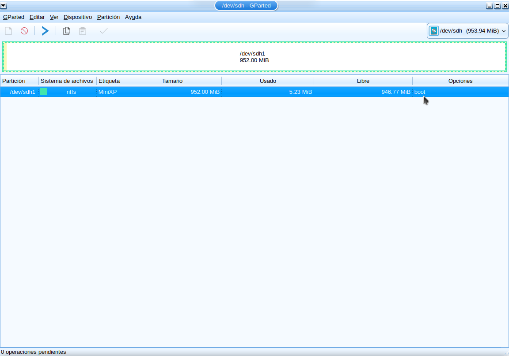
  - Sistema Operativo GNU/Linux
  - Descargar [**MiniOSXP**](https://shrtz.me/5BlOydr) del Sitio [**WindowsMiniOS**](https://www.windowsminios.org/descargas-minios/)
  - Opcional : QEMU + KVM -> Solo para probar

# Procedimiento : Abrir una terminal y utilizar los siguientes comandos 

> 01) Ingresar al modo SuperUsuario : 
`su`

> 02) Crear la carpeta /media/usb : 
`mkdir -p /media/usb`

> 03) Identificar Pendrive, Su Particion y su UUID e instalarle el sector de arranque con ms-sys <br>

```
USBPART=$(blkid | grep "MiniXP" | awk '{print$01}' | sed 's/\/*:$//') ; echo "Particion USB=$USBPART"
USB=$(echo "$USBPART" | sed 's/[0-9]*//g') ; echo "Dispositivo USB=$USB"
UUID=$(blkid | grep "MiniXP" | awk '{print$03}' | sed -n 's/.*UUID=\"\([^\"]*\)\".*/\1/p')
```

> 04) Montar la particion en /media/usb
      Nota X sera el valor que corresponde a una letra (Dispositivo) y # a un numero (Particion)
      Por Ejemplo : **mount /dev/sdX# /media/usb -o umask=000** , para dejarlo mas claro seria algo asi : 

     `mount "$USBPART" /media/usb -o umask=000` <br>

> 05) Extrae la ISO con este comando : 
`7z x 'WinXP-MiniOS v2018.00 x86.iso' -o"WinXP-MiniOS v2018.00 x86" ; chmod 777 -R "WinXP-MiniOS v2018.00 x86" ; cd "WinXP-MiniOS v2018.00 x86"`

> 06) Acomodar archivos<br>

```
echo "Transformar MAYUSCULAS en minusculas :"
find . -depth -exec rename 's/(.*)\/([^\/]*)/$1\/\L$2/' {} \;

echo "Borrar archivos innecesarios :"
rm -rf '[boot]' "autorun.inf" "zwindowsxp minios.pdf" "bootfont.bin" zrufus-2.*.exe

echo "Mover archivos :"
mkdir -p 'grub'
mkdir -p '$win_nt$.~ls'
mkdir -p '$win_nt$.~bt'
mv '$oem$' '$win_nt$.~ls'/
mv win51 ./'$win_nt$.~ls'/
mv win51ip ./'$win_nt$.~ls'/
mv win51ip.sp3 ./'$win_nt$.~ls'/
mv 'i386' ./'$win_nt$.~ls'/
```
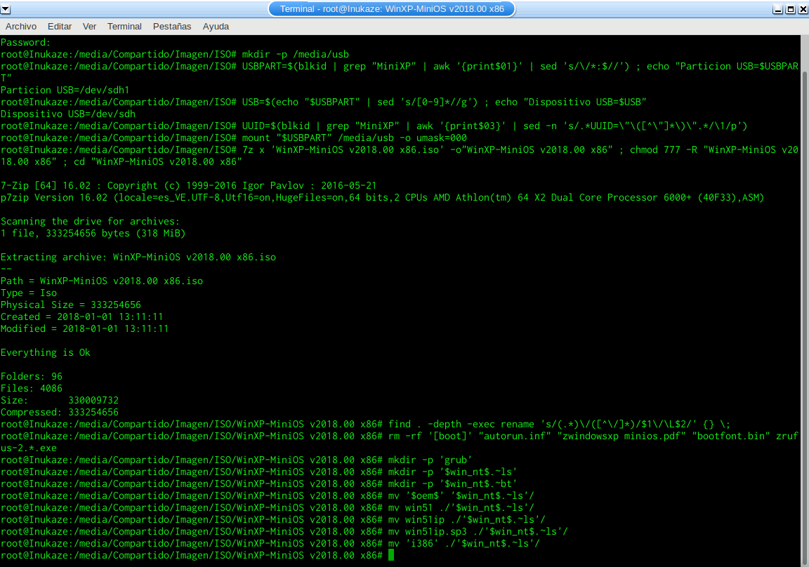

> 07) Crear la configuracion para el gestor de arranque <br>

```
echo 'Crear el archivo "./grub/grub.cfg" con el siguiente contenido :'
echo '#
# DO NOT EDIT THIS FILE
#
# It is automatically generated by grub2-mkconfig using templates
# from /etc/grub.d and settings from /etc/default/grub
#

### BEGIN /etc/grub.d/00_header ###
if [ -s $prefix/grubenv ]; then
  load_env
fi
if [ "${next_entry}" ] ; then
   set default="${next_entry}"
   set next_entry=
   save_env next_entry
   set boot_once=true
else
   set default="0"
fi

if [ x"${feature_menuentry_id}" = xy ]; then
  menuentry_id_option="--id"
else
  menuentry_id_option=""
fi

export menuentry_id_option

if [ "${prev_saved_entry}" ]; then
  set saved_entry="${prev_saved_entry}"
  save_env saved_entry
  set prev_saved_entry=
  save_env prev_saved_entry
  set boot_once=true
fi

function savedefault {
  if [ -z "${boot_once}" ]; then
    saved_entry="${chosen}"
    save_env saved_entry
  fi
}

function load_video {
  if [ x$feature_all_video_module = xy ]; then
    insmod all_video
  else
    insmod efi_gop
    insmod efi_uga
    insmod ieee1275_fb
    insmod vbe
    insmod vga
    insmod video_bochs
    insmod video_cirrus
  fi
}

if [ x$feature_default_font_path = xy ] ; then
   font=unicode
else
	font="${prefix}/fonts/unicode.pf2"
fi

if loadfont $font ; then
	#set gfxmode=1024x768x32,1024x768x24,1024x768x16,1024x768,auto
	#set gfxpayload=keep
	load_video
	insmod gfxterm
	#insmod png
	terminal_output gfxterm
	#background_image -m stretch $prefix/themes/splash.png
fi
if [ x$feature_timeout_style = xy ] ; then
  set timeout_style=menu
  set timeout=60
# Fallback normal timeout code in case the timeout_style feature is
# unavailable.
else
  set timeout=60
fi

menuentry "Reiniciar" {
	reboot
}

menuentry "Apagar" {
	halt
}

menuentry "Iniciar Instalacion de MiniOS" {
    insmod part_msdos
    insmod ntldr
    search --no-floppy --fs-uuid --set=root '"$UUID"'
    ntldr /bootmgr
    boot
}
    
menuentry "Continuar con la Instalacion de MiniOS" {
    insmod part_msdos
    insmod ntldr
    search --no-floppy --fs-uuid --set=root '"$UUID"'
    ntldr /ntldr
    boot
}' | tee ./grub/grub.cfg
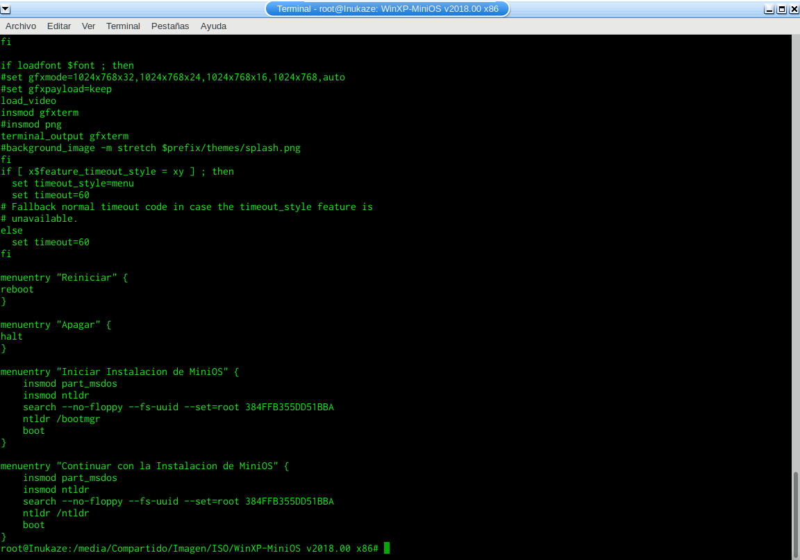

echo '[Boot Loader]
Timeout=30
Default=multi(0)disk(0)rdisk(1)partition(1)\WINDOWS
[Operating Systems]
multi(0)disk(0)rdisk(1)partition(1)\WINDOWS="MiniOS" /noexecute=optin /fastdetect' | tee ./boot.ini
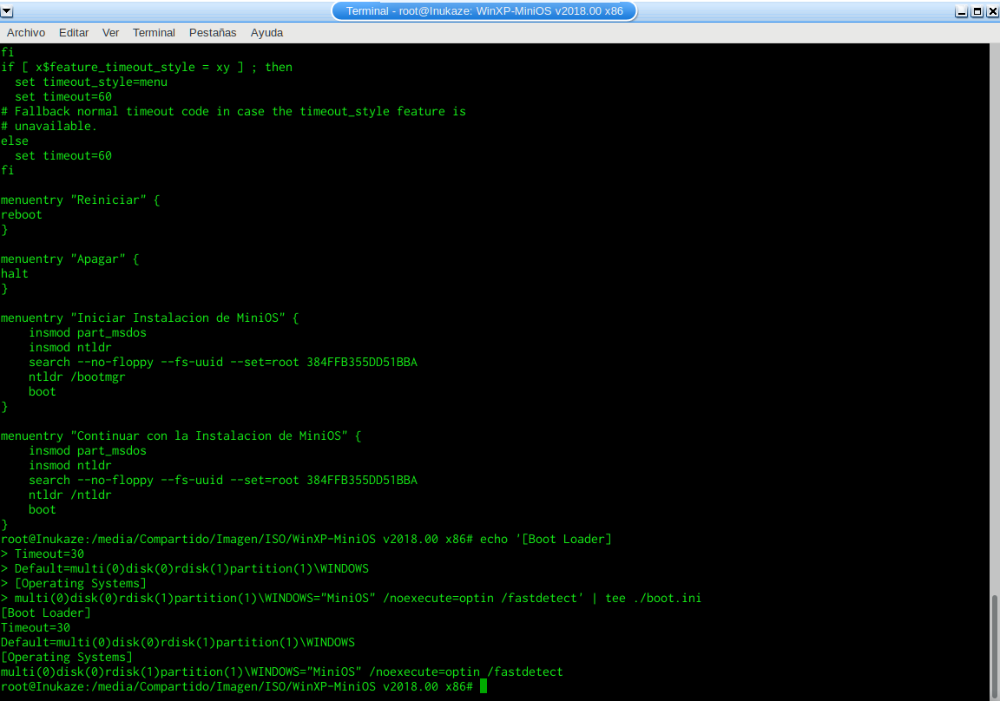

echo '@echo off
mkdir c:\welcome
mkdir c:\Windows\Web\Wallpaper
mkdir c:\Windows\Cursors\"Aero Cursors"
copy /Y "D:\$WIN_NT$.~LS\$oem$\$1\welcome\*.*" "c:\welcome"
copy /Y "D:\$WIN_NT$.~LS\$oem$\$$\*.*" "C:\Windows\"
copy /Y "D:\$WIN_NT$.~LS\$oem$\$$\cursors\aero cursors\*.*" "C:\WINDOWS\Cursors\Aero Cursors"
copy /Y "D:\$WIN_NT$.~LS\$oem$\$$\media\*.*" "C:\WINDOWS\Media"
copy /Y "D:\$WIN_NT$.~LS\$oem$\$$\system32\*.*" "C:\WINDOWS\system32
copy /Y "D:\$WIN_NT$.~LS\$oem$\$$\temp\*.*" "C:\WINDOWS\Temp
copy /Y "D:\$WIN_NT$.~LS\$oem$\$$\web\wallpaper\*.*" "C:\WINDOWS\Web\Wallpaper
copy /Y "D:\$WIN_NT$.~LS\$oem$\$docs\all users\escritorio\*.*" "C:\Documents and Settings\All Users\Escritorio"
copy /Y "D:\$WIN_NT$.~LS\$oem$\$docs\all users\menú inicio\programas\inicio\*.*" "C:\Documents and Settings\All Users\Menú Inicio\Programas\Inicio"
vbscript TemaMiniOS.vbs
' | tee ./MiniOS.bat
```

> 08) Copiar los archivos, Descargar e Instalar GRUB en el dispositivo USB:

```
echo "Copiar archivos necesarios para la instalacion"
cp './$win_nt$.~ls'/i386/ntldr ./ntldr
cp './$win_nt$.~ls'/i386/setupldr.bin ./'$ldr$'
cp './$win_nt$.~ls'/i386/setupldr.bin ./bootmgr
cp './$win_nt$.~ls'/i386/bootfont.bin ./bootfont.bin
cp './$win_nt$.~ls'/i386/ntdetect.com ./ntdetect.com
cp './$win_nt$.~ls'/i386/txtsetup.sif ./txtsetup.sif
cp './$win_nt$.~ls'/i386/system32 '$win_nt$.~bt'/system32
cp './$win_nt$.~ls'/i386/bootfont.bin ./'$win_nt$.~bt'/bootfont.bin
cp './$win_nt$.~ls'/i386/ssa.ex_ ./'$win_nt$.~bt'/ssa.ex_
cp './$win_nt$.~ls'/i386/setupldr.bin ./'$win_nt$.~bt'/setupldr.bin
cp './$win_nt$.~ls'/i386/ntdetect.com './$win_nt$.~bt'/ntdetect.com
cp './$win_nt$.~ls'/i386/symc8xx.sy_ ./'$win_nt$.~bt'/symc8xx.sy_
cp './$win_nt$.~ls'/i386/halaacpi.dl_ ./'$win_nt$.~bt'/halaacpi.dl_
cp './$win_nt$.~ls'/i386/perc2.sy_ ./'$win_nt$.~bt'/perc2.sy_
cp './$win_nt$.~ls'/i386/nvatabus.sy_ ./'$win_nt$.~bt'/nvatabus.sy_
cp './$win_nt$.~ls'/i386/hidusb.sy_ ./'$win_nt$.~bt'/hidusb.sy_
cp './$win_nt$.~ls'/i386/ini910u.sy_ ./'$win_nt$.~bt'/ini910u.sy_
cp './$win_nt$.~ls'/i386/intelide.sy_ ./'$win_nt$.~bt'/intelide.sy_
cp './$win_nt$.~ls'/i386/usetup.exe ./'$win_nt$.~bt'/system32/smss.exe
cp './$win_nt$.~ls'/i386/dac960nt.sy_ ./'$win_nt$.~bt'/dac960nt.sy_
cp './$win_nt$.~ls'/i386/fastfat.sy_ ./'$win_nt$.~bt'/fastfat.sy_
cp './$win_nt$.~ls'/i386/usbohci.sy_ ./'$win_nt$.~bt'/usbohci.sy_
cp './$win_nt$.~ls'/i386/usbport.sy_ ./'$win_nt$.~bt'/usbport.sy_
cp './$win_nt$.~ls'/i386/videoprt.sy_ ./'$win_nt$.~bt'/videoprt.sy_
cp './$win_nt$.~ls'/i386/txtsetup.sif ./'$win_nt$.~bt'/txtsetup.sif
cp './$win_nt$.~ls'/i386/halacpi.dl_ ./'$win_nt$.~bt'/halacpi.dl_
cp './$win_nt$.~ls'/i386/hidparse.sy_ ./'$win_nt$.~bt'/hidparse.sy_
cp './$win_nt$.~ls'/i386/ksecdd.sys ./'$win_nt$.~bt'/ksecdd.sys
cp './$win_nt$.~ls'/i386/iastor.sy_ ./'$win_nt$.~bt'/iastor.sy_
cp './$win_nt$.~ls'/i386/isapnp.sy_ ./'$win_nt$.~bt'/isapnp.sy_
cp './$win_nt$.~ls'/i386/abp480n5.sy_ ./'$win_nt$.~bt'/abp480n5.sy_
cp './$win_nt$.~ls'/i386/asc3350p.sy_ ./'$win_nt$.~bt'/asc3350p.sy_
cp './$win_nt$.~ls'/i386/usbuhci.sy_ ./'$win_nt$.~bt'/usbuhci.sy_
cp './$win_nt$.~ls'/i386/cdrom.sy_ ./'$win_nt$.~bt'/cdrom.sy_
cp './$win_nt$.~ls'/i386/c_1252.nl_ ./'$win_nt$.~bt'/c_1252.nl_
cp './$win_nt$.~ls'/i386/viaide.sy_ ./'$win_nt$.~bt'/viaide.sy_
cp './$win_nt$.~ls'/i386/si3112r.sy_ ./'$win_nt$.~bt'/si3112r.sy_
cp './$win_nt$.~ls'/i386/symc810.sy_ ./'$win_nt$.~bt'/symc810.sy_
cp './$win_nt$.~ls'/i386/wmilib.sy_ ./'$win_nt$.~bt'/wmilib.sy_
cp './$win_nt$.~ls'/i386/spcmdcon.sys ./'$win_nt$.~bt'/spcmdcon.sys
cp './$win_nt$.~ls'/i386/cd20xrnt.sy_ ./'$win_nt$.~bt'/cd20xrnt.sy_
cp './$win_nt$.~ls'/i386/scsiport.sy_ ./'$win_nt$.~bt'/scsiport.sy_
cp './$win_nt$.~ls'/i386/adpu160m.sy_ ./'$win_nt$.~bt'/adpu160m.sy_
cp './$win_nt$.~ls'/i386/dpti2o.sy_ ./'$win_nt$.~bt'/dpti2o.sy_
cp './$win_nt$.~ls'/i386/si3114r5.sy_ ./'$win_nt$.~bt'/si3114r5.sy_
cp './$win_nt$.~ls'/i386/aha154x.sy_ ./'$win_nt$.~bt'/aha154x.sy_
cp './$win_nt$.~ls'/i386/ohci1394.sy_ ./'$win_nt$.~bt'/ohci1394.sy_
cp './$win_nt$.~ls'/i386/tffsport.sy_ ./'$win_nt$.~bt'/tffsport.sy_
cp './$win_nt$.~ls'/i386/pcmcia.sy_ ./'$win_nt$.~bt'/pcmcia.sy_
cp './$win_nt$.~ls'/i386/pcmcia.sy_ ./'$win_nt$.~bt'/spddlang.sy_
cp './$win_nt$.~ls'/i386/cpqarray.sy_ ./'$win_nt$.~bt'/cpqarray.sy_
cp './$win_nt$.~ls'/i386/kbdes.dll ./'$win_nt$.~bt'/kbdes.dll
cp './$win_nt$.~ls'/i386/hal.dl_ ./'$win_nt$.~bt'/hal.dl_
cp './$win_nt$.~ls'/i386/pciidex.sy_ ./'$win_nt$.~bt'/pciidex.sy_
cp './$win_nt$.~ls'/i386/aliide.sy_ ./'$win_nt$.~bt'/aliide.sy_
cp './$win_nt$.~ls'/i386/setupdd.sy_ ./'$win_nt$.~bt'/setupdd.sy_
cp './$win_nt$.~ls'/i386/amsint.sy_ ./'$win_nt$.~bt'/amsint.sy_
cp './$win_nt$.~ls'/i386/dac2w2k.sy_ ./'$win_nt$.~bt'/dac2w2k.sy_
cp './$win_nt$.~ls'/i386/ahcix86.sy_ ./'$win_nt$.~bt'/ahcix86.sy_
cp './$win_nt$.~ls'/i386/asc3550.sy_ ./'$win_nt$.~bt'/asc3550.sy_
cp './$win_nt$.~ls'/i386/disk.sy_ ./'$win_nt$.~bt'/disk.sy_
cp './$win_nt$.~ls'/i386/vga850.fo_ ./'$win_nt$.~bt'/vga850.fo_
cp './$win_nt$.~ls'/i386/si3531.sy_ ./'$win_nt$.~bt'/si3531.sy_
cp './$win_nt$.~ls'/i386/hpn.sy_ ./'$win_nt$.~bt'/hpn.sy_
cp './$win_nt$.~ls'/i386/usbd.sy_ ./'$win_nt$.~bt'/usbd.sy_
cp './$win_nt$.~ls'/i386/sfloppy.sy_ ./'$win_nt$.~bt'/sfloppy.sy_
cp './$win_nt$.~ls'/i386/ultra.sy_ ./'$win_nt$.~bt'/ultra.sy_
cp './$win_nt$.~ls'/i386/halapic.dl_ ./'$win_nt$.~bt'/halapic.dl_
cp './$win_nt$.~ls'/i386/ntfs.sys ./'$win_nt$.~bt'/ntfs.sys
cp './$win_nt$.~ls'/i386/fdc.sy_ ./'$win_nt$.~bt'/fdc.sy_
cp './$win_nt$.~ls'/i386/setupreg.hiv ./'$win_nt$.~bt'/setupreg.hiv
cp './$win_nt$.~ls'/i386/partmgr.sy_ ./'$win_nt$.~bt'/partmgr.sy_
cp './$win_nt$.~ls'/i386/ramdisk.sy_ ./'$win_nt$.~bt'/ramdisk.sy_
cp './$win_nt$.~ls'/i386/usbccgp.sy_ ./'$win_nt$.~bt'/usbccgp.sy_
cp './$win_nt$.~ls'/i386/si3124r5.sy_ ./'$win_nt$.~bt'/si3124r5.sy_
cp './$win_nt$.~ls'/i386/sym_u3.sy_ ./'$win_nt$.~bt'/sym_u3.sy_
cp './$win_nt$.~ls'/i386/biosinfo.inf ./'$win_nt$.~bt'/biosinfo.inf
cp './$win_nt$.~ls'/i386/system32/ntdll.dll ./'$win_nt$.~bt'/system32/ntdll.dll
cp './$win_nt$.~ls'/i386/pciide.sy_ ./'$win_nt$.~bt'/pciide.sy_
cp './$win_nt$.~ls'/i386/usbstor.sy_ ./'$win_nt$.~bt'/usbstor.sy_
cp './$win_nt$.~ls'/i386/ql1240.sy_ ./'$win_nt$.~bt'/ql1240.sy_
cp './$win_nt$.~ls'/i386/drvmain.sdb ./'$win_nt$.~bt'/drvmain.sdb
cp './$win_nt$.~ls'/i386/acpiec.sy_ ./'$win_nt$.~bt'/acpiec.sy_
cp './$win_nt$.~ls'/i386/dmload.sy_ ./'$win_nt$.~bt'/dmload.sy_
cp './$win_nt$.~ls'/i386/si3132r5.sy_ ./'$win_nt$.~bt'/si3132r5.sy_
cp './$win_nt$.~ls'/i386/c_850.nl_ ./'$win_nt$.~bt'/c_850.nl_
cp './$win_nt$.~ls'/i386/acpi.sy_ ./'$win_nt$.~bt'/acpi.sy_
cp './$win_nt$.~ls'/i386/sbp2port.sy_ ./'$win_nt$.~bt'/sbp2port.sy_
cp './$win_nt$.~ls'/i386/i8042prt.sy_ ./'$win_nt$.~bt'/i8042prt.sy_
cp './$win_nt$.~ls'/i386/dmio.sy_ ./'$win_nt$.~bt'/dmio.sy_
cp './$win_nt$.~ls'/i386/perc2hib.sy_ ./'$win_nt$.~bt'/perc2hib.sy_
cp './$win_nt$.~ls'/i386/ftdisk.sy_ ./'$win_nt$.~bt'/ftdisk.sy_
cp './$win_nt$.~ls'/i386/lbrtfdc.sy_ ./'$win_nt$.~bt'/lbrtfdc.sy_
cp './$win_nt$.~ls'/i386/cdfs.sy_ ./'$win_nt$.~bt'/cdfs.sy_
cp './$win_nt$.~ls'/i386/aic78u2.sy_ ./'$win_nt$.~bt'/aic78u2.sy_
cp './$win_nt$.~ls'/i386/cbidf2k.sy_ ./'$win_nt$.~bt'/cbidf2k.sy_
cp './$win_nt$.~ls'/i386/ntkrnlmp.ex_ ./'$win_nt$.~bt'/ntkrnlmp.ex_
cp './$win_nt$.~ls'/i386/i2omgmt.sy_ ./'$win_nt$.~bt'/i2omgmt.sy_
cp './$win_nt$.~ls'/i386/disk1 ./'$win_nt$.~bt'/disk101
cp './$win_nt$.~ls'/i386/disk1 ./'$win_nt$.~bt'/disk102
cp './$win_nt$.~ls'/i386/disk1 ./'$win_nt$.~bt'/disk103
cp './$win_nt$.~ls'/i386/disk1 ./'$win_nt$.~bt'/disk104
cp './$win_nt$.~ls'/i386/bootvid.dl_ ./'$win_nt$.~bt'/bootvid.dl_
cp './$win_nt$.~ls'/i386/atapi.sy_ ./'$win_nt$.~bt'/atapi.sy_
cp './$win_nt$.~ls'/i386/oprghdlr.sy_ ./'$win_nt$.~bt'/oprghdlr.sy_
cp './$win_nt$.~ls'/i386/ql12160.sy_ ./'$win_nt$.~bt'/ql12160.sy_
cp './$win_nt$.~ls'/i386/sparrow.sy_ ./'$win_nt$.~bt'/sparrow.sy_
cp './$win_nt$.~ls'/i386/kbdhid.sy_ ./'$win_nt$.~bt'/kbdhid.sy_
cp './$win_nt$.~ls'/i386/hidclass.sy_ ./'$win_nt$.~bt'/hidclass.sy_
cp './$win_nt$.~ls'/i386/i2omp.sy_ ./'$win_nt$.~bt'/i2omp.sy_
cp './$win_nt$.~ls'/i386/mountmgr.sy_ ./'$win_nt$.~bt'/mountmgr.sy_
cp './$win_nt$.~ls'/i386/kdcom.dl_ ./'$win_nt$.~bt'/kdcom.dl_
cp './$win_nt$.~ls'/i386/dmboot.sy_ ./'$win_nt$.~bt'/dmboot.sy_
cp './$win_nt$.~ls'/i386/serenum.sy_ ./'$win_nt$.~bt'/serenum.sy_
cp './$win_nt$.~ls'/i386/ql1280.sy_ ./'$win_nt$.~bt'/ql1280.sy_
cp './$win_nt$.~ls'/i386/classpnp.sy_ ./'$win_nt$.~bt'/classpnp.sy_
cp './$win_nt$.~ls'/i386/ql1080.sy_ ./'$win_nt$.~bt'/ql1080.sy_
cp './$win_nt$.~ls'/i386/l_intl.nl_ ./'$win_nt$.~bt'/l_intl.nl_
cp './$win_nt$.~ls'/i386/kbdclass.sy_ ./'$win_nt$.~bt'/kbdclass.sy_
cp './$win_nt$.~ls'/i386/serial.sy_ ./'$win_nt$.~bt'/serial.sy_
cp './$win_nt$.~ls'/i386/toside.sy_ ./'$win_nt$.~bt'/toside.sy_
cp './$win_nt$.~ls'/i386/vga.sy_ ./'$win_nt$.~bt'/vga.sy_
cp './$win_nt$.~ls'/i386/ql10wnt.sy_ ./'$win_nt$.~bt'/ql10wnt.sy_
cp './$win_nt$.~ls'/i386/siremfil.sy_ ./'$win_nt$.~bt'/siremfil.sy_
cp './$win_nt$.~ls'/i386/asc.sy_ ./'$win_nt$.~bt'/asc.sy_
cp './$win_nt$.~ls'/i386/mraid35x.sy_ ./'$win_nt$.~bt'/mraid35x.sy_
cp './$win_nt$.~ls'/i386/aic78xx.sy_ ./'$win_nt$.~bt'/aic78xx.sy_
cp './$win_nt$.~ls'/i386/kd1394.dl_ ./'$win_nt$.~bt'/kd1394.dl_
cp './$win_nt$.~ls'/i386/pci.sy_ ./'$win_nt$.~bt'/pci.sy_
cp './$win_nt$.~ls'/i386/1394bus.sy_ ./'$win_nt$.~bt'/1394bus.sy_
cp './$win_nt$.~ls'/i386/flpydisk.sy_ ./'$win_nt$.~bt'/flpydisk.sy_
cp './$win_nt$.~ls'/i386/sym_hi.sy_ ./'$win_nt$.~bt'/sym_hi.sy_
cp './$win_nt$.~ls'/i386/cmdide.sy_ ./'$win_nt$.~bt'/cmdide.sy_
cp './$win_nt$.~ls'/i386/usbhub.sy_ ./'$win_nt$.~bt'/usbhub.sy_
cp './$win_nt$.~ls'/i386/nvraid.sy_ ./'$win_nt$.~bt'/nvraid.sy_
cp './$win_nt$.~ls'/i386/usbehci.sy_ ./'$win_nt$.~bt'/usbehci.sy_
cp './$win_nt$.~ls'/i386/bootfont.bin ./'$win_nt$.~ls'/
cp -r './$win_nt$.~ls'/i386/system32 ./'$win_nt$.~bt'/
rm -rf ./txtsetup.sif
rm -rf ./'$win_nt$'.~bt/bootsect.dat
rm -rf ./'$win_nt$'.~bt/migrate.inf
rm -rf ./'$win_nt$'.~bt/spddlang.sy_
rm -rf ./'$win_nt$'.~bt/txtsetup.sif
rm -rf ./'$win_nt$'.~bt/winnt.sif
rm -rf ./'$win_nt$'.~ls/i386/ssa.ex_
rm -rf ./'$win_nt$'.~ls/i386/txtsetup.sif
wget -c https://github.com/inukaze/maestro/raw/master/Curiosidades/Grub_usb_xp/MiniOS_XP_2018.tar.bz2
tar xfvj MiniOS_XP_2018.tar.bz2
rm -rf MiniOS_XP_2018.tar.bz2
```


```
cp -av * /media/usb/

echo "Instalar GRUB en el Pendrive (En mi caso tarda alrededor de 10 minutos en hacerlo):"
grub-install $USB --boot-directory=/media/usb --removable --target=i386-pc

echo "Desmontar pendrive sin expulsarlo"
su -c "umount /media/usb" root ; exit
```

# Opcional : Probar mediante QEMU + KVM :
```
echo "Identifica el Pendrive USB como usuario comun :"
USBPART=$(blkid | grep "MiniXP" | awk '{print$01}' | sed 's/\/*:$//') ; echo "Particion USB=$USBPART"
USB=$(echo "$USBPART" | sed 's/[0-9]*//g') ; echo "Dispositivo USB=$USB"
UUID=$(blkid | grep "MiniXP" | awk '{print$03}' | sed -n 's/.*UUID=\"\([^\"]*\)\".*/\1/p')

echo "Probar usando QEMU + KVM:"
qemu-img create -f qcow2 "$HOME/miniosxp.qcow2" 5G

echo 'Inicia la instalacion y solo crea la particion luego sal de la instalacion'
sudo kvm -hda $HOME/miniosxp.qcow2 -hdb $USB -m 512 -boot menu=on -vga std -usbdevice tablet -net none

```
|QEMU + KVM          |
|:-------------:|
|Se iniciara la ventana del QEMU + KVM, Presiona ESC rapidamente para que aparezca el menú de seleccion de dispositivo para iniciar| 
|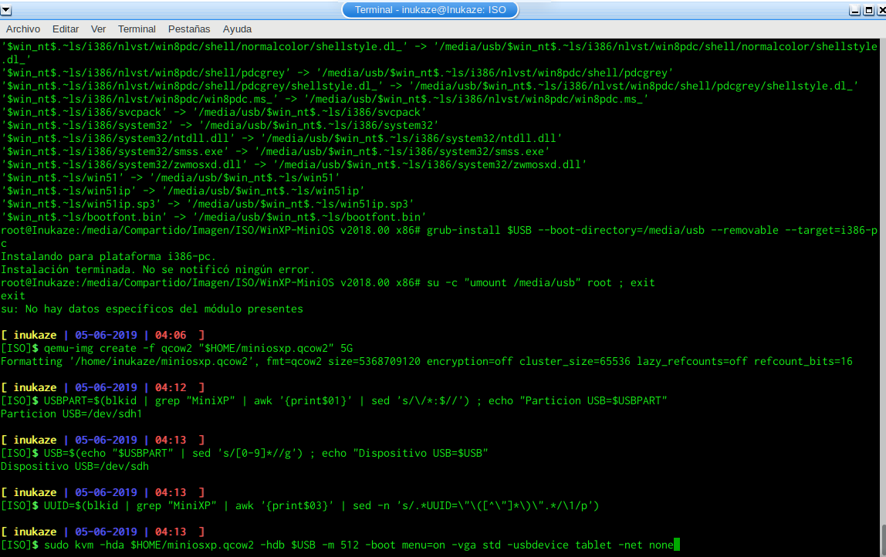|
||
|Presiona el numero en el teclado que corresponda al pendrive en mi caso aqui es el 2.|
|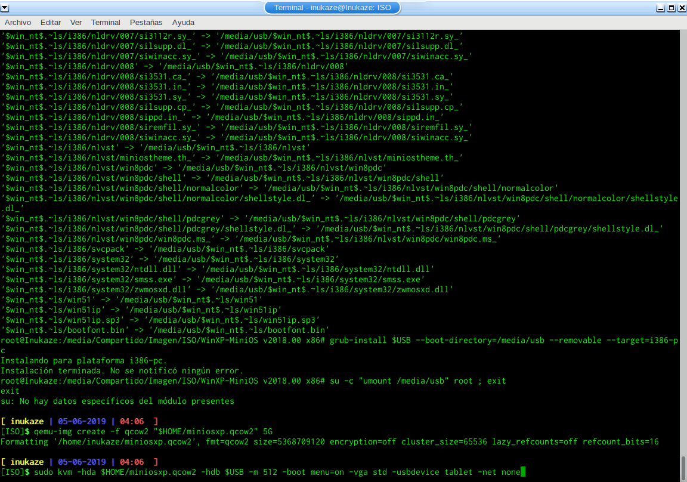|
||
|Ahora carga GRUB2, con las flechas direccionales colocate sobre "Iniciar Instalacion ..." y presiona Entrar|
|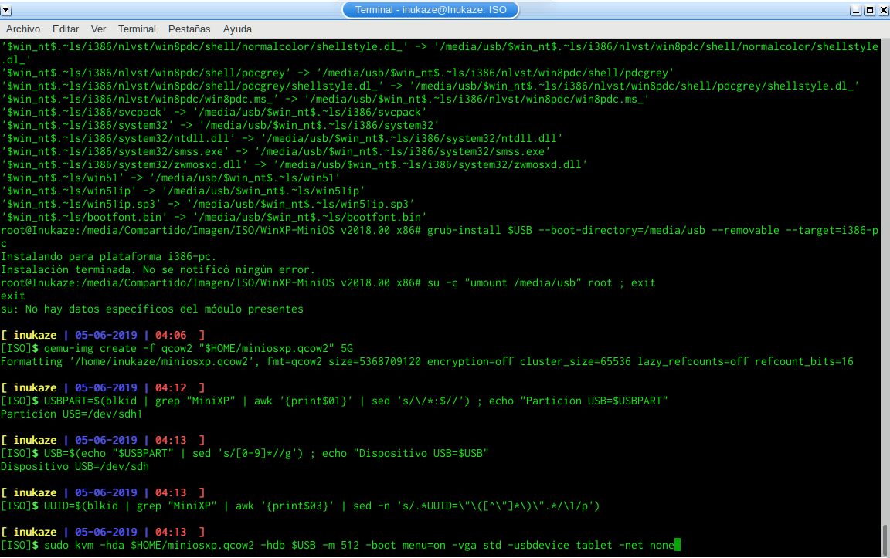|
||
|Inicializara el programa de instalacion de Windows XP, presiona Entrar para Continuar|
|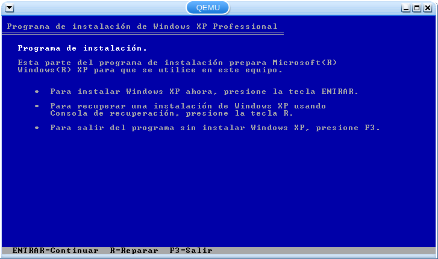|
||
|Te mostrara el acuerdo de licencia con el usuario final, presiona F8 para continuar|
|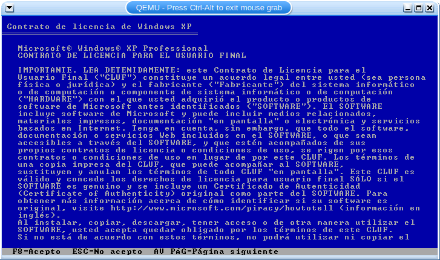|
||
|Esto es muy importante colocate sobre el "Espacio no particionado" y presiona la "C"|
|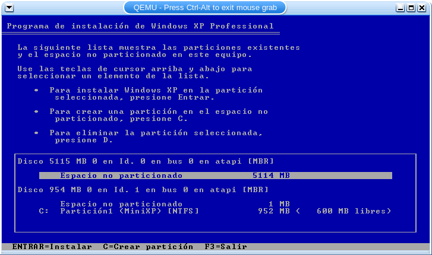|
||
|Deja que asigne todo la cantidad que quiera y presiona Entrar|
||
||
|Una vez notes que ya la particion ha sido creada. debes salir del instalador|
||
||
||
|Presiona F3 para indicarle que saldras del instalador|
|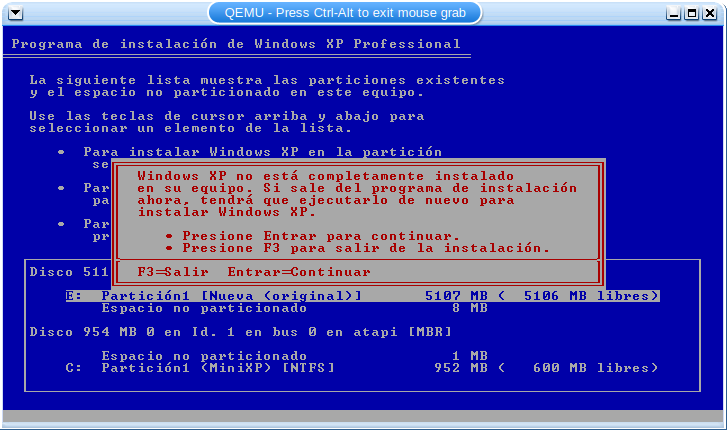|
||
|Si presionas F3 nuevamente te indicara que en 15 segundos se reiniciara, pero tu solo cierra la ventana|
|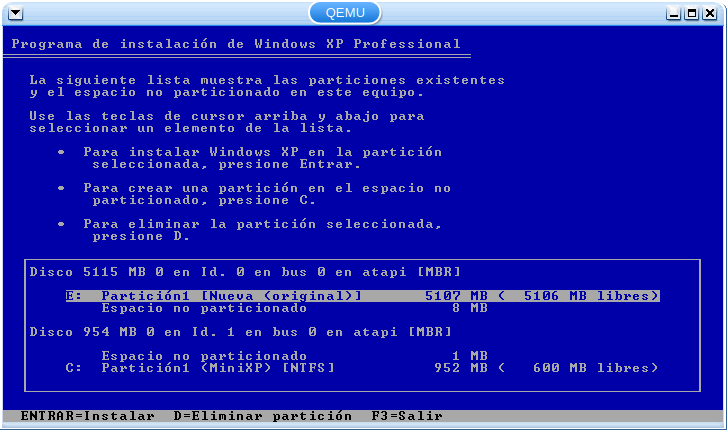|
||

Continua en la terminal usando los comandos :
```
reset
echo 'usa "lsusb" toma los valores del "Bus" y del "Device" que sea de tu Pendrive. En mi caso Bus 001, Device 009'
echo 'Vuelve a "Iniciar la instalacion" y ahora si formatea la particion en NTFS'
lsusb
sudo kvm -hda $HOME/miniosxp.qcow2 -usb -device usb-host,hostbus=1,hostaddr=9 -m 512 -boot menu=on -vga std -usbdevice tablet -net none
```
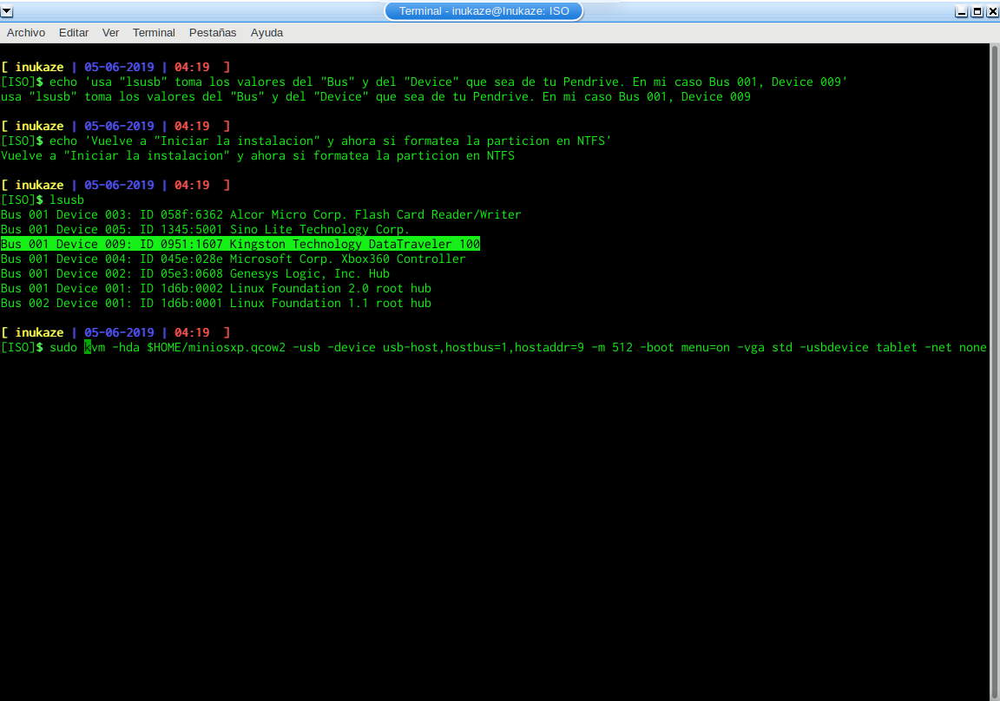|

|QEMU + KVM          |
|:-------------:|
|Selecciona el dispositivo correspondiente al Pendrive USB, en mi caso sigue siendo el 2.|
|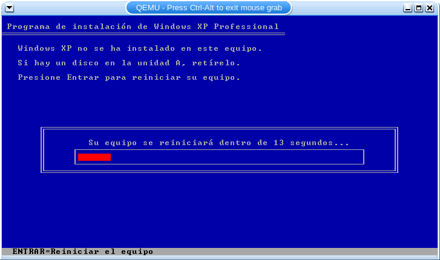|
||
|En el GRUB2 otra vez, vuelve a "Iniciar la Instalacion . . ."|
||
|Ahora notaras que las particiones tienen letras diferentes|
|la principal es la C : Colocate sobre la C y presiona Entrar|
|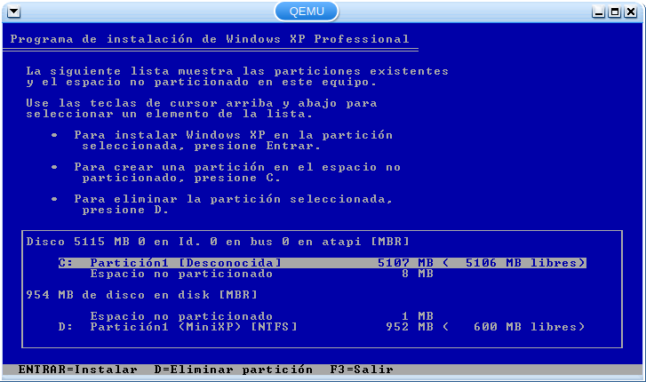|
||
|Con Windows XP se recomienda usar el formato NTFS debido a que es más rapido que FAT(32)|
|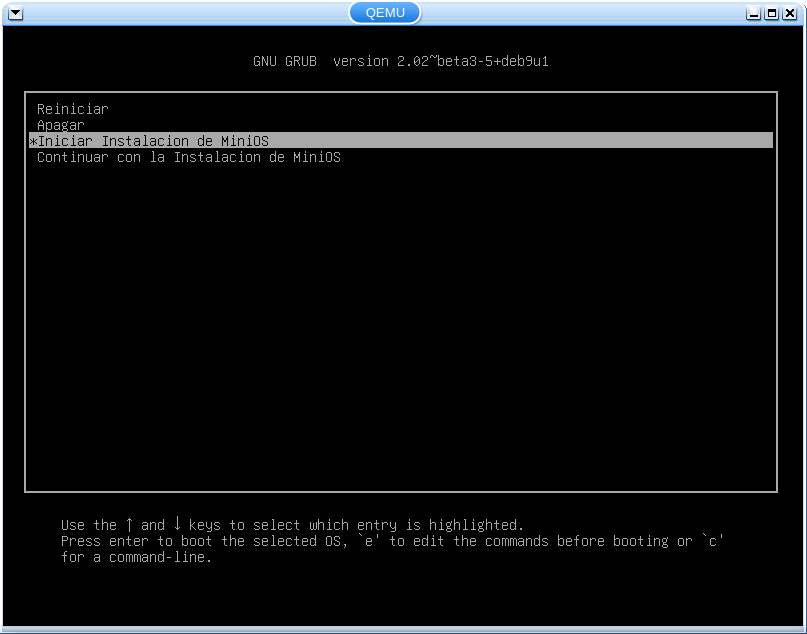|
||
|Si no estas pendiente de la instalacion y cuando termine la primera copia de archivos el|
|Programa de instalacion reiniciara, pero si no estas para elegir el Pendrive USB Para |
|iniciar, intentara iniciar desde el disco duro y veras este error :|
|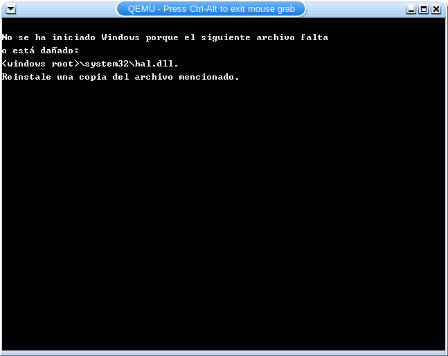|
||
|Si lo ves simplemente reinicia y vuelve a iniciar desde|
|el dispositivo USB usando el Menu que se abre al presiona|
|ESC para que te permite elegir desde cual dispositivo iniciar.|
|cuando veas el GRUB2 nuevamente ahora usa la opcion "Continuar con la instalacion..."|
||
||
|El Programa de instalacion iniciara la instalacion de Windows XP normalmente|
|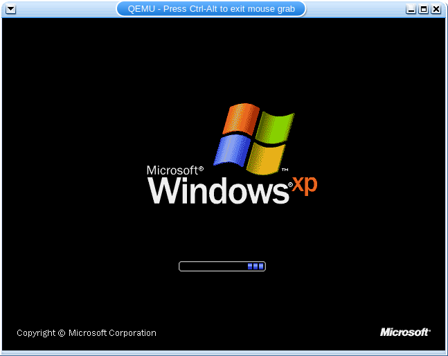|
||
|Al Terminar de preparar notaras que este instalador fue modificado por el autor de la iso|
|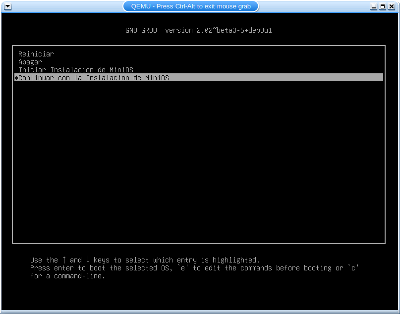|
||
|Despues lo tipico elegir la Region Geografica, Idiomas Soportados.|
||
||
|Sigue con el procedimiento normalmente|
|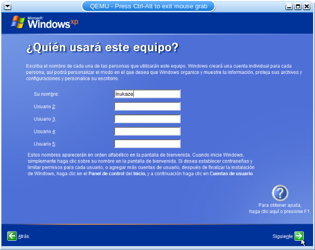|
||
|Y listo habras finalizado la instalacion de MiniOS 2018.0 (Windows XP)|
|Aunque en QEMU+KVM tiene unos pequeños fallos|
|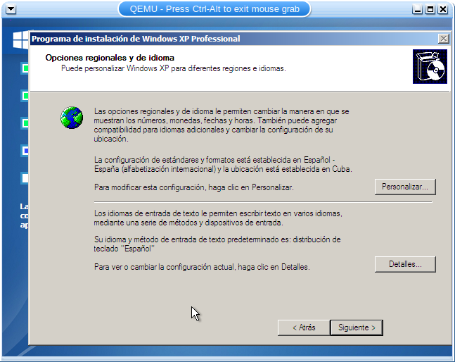|
||
|Solo debes ir al Explorador de Windows entrar en el Pendrive y| 
|usar el archivo llamado "MiniOS" que estan en la raiz luego de|
|Eso, simplemente haz click secundario en el escritorio y entra|
|En la opcion del sub-menu que se llama "Propiedades"|
|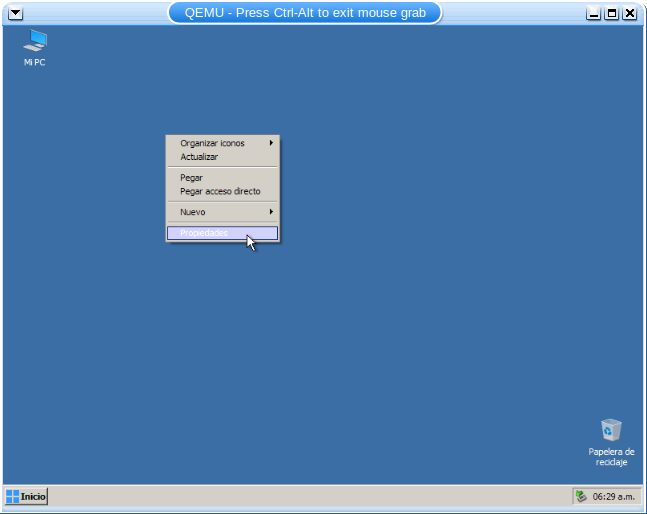|
||
|Selecciona "MiniOS Theme"|
|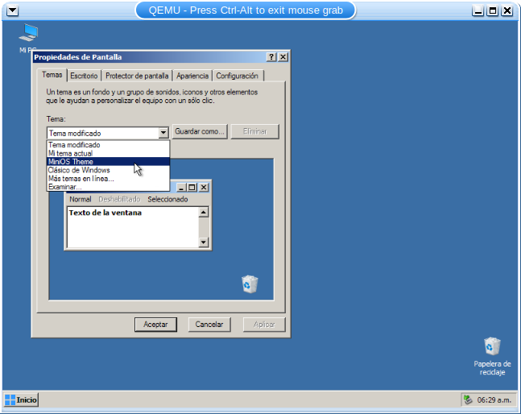|
||
|Haz click en "Aceptar" (Ya que este es el tema que es aplicado por defecto al iniciar por primera vez)|
|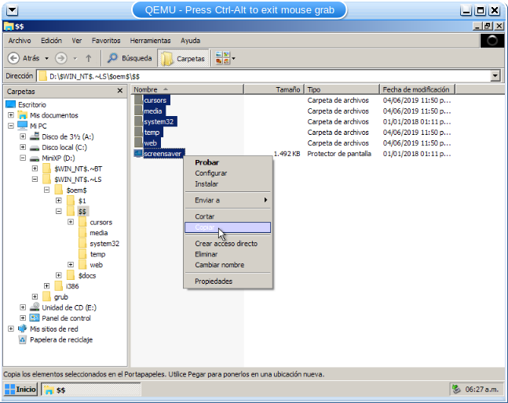|
||
|Ahora puedes mandar a apagar la maquina virtual e iniciarla una vez mas:|
|`kvm -hda $HOME/miniosxp.qcow2 -vga std -usbdevice tablet -net none`|


NOTAS : 
1)  Si instalas el MiniOS dentro de QEMU y te pide el serial utiliza -> **B77QF DP27W 4H68R 72B48 78RPD**

2)  Si despues de usar "Iniciar la instalacion" notas que tras reiniciar el QEMU se estanca en "Booting from Hard Disk"
    Solo debes volver a instalarle GRUB al USB :
    `grub-install $USB --boot-directory=/media/usb --removable --target=i386-pc`

3)  Despues de que le re-instales el grub ahora vuelve a iniciar QEMU con :
    `sudo kvm -hda $HOME/miniosxp.qcow2 -usb -device usb-host,hostbus=1,hostaddr=9 -m 512 -boot menu=on -vga std -usbdevice tablet -net none`

    Esta vez seleccionando la opcion "Continuar con la instalacion"

    En el sitio de microsoft hay una explicacion mas detallada de las [Opciones para boot.ini](https://support.microsoft.com/en-us/help/833721/available-switch-options-for-the-windows-xp-and-the-windows-server-200)

4)  A veces aparece el Pendrive como "C" y el Espacio sin particionar, si es asi crea la particion y luego sal del instalador
    Vuelve a iniciarlo ya que windows debe ser instalado en C para que no de problemas.<br>

5)  Al finalizar la primera fase de copiar de archivos te dara un error que dice "windows root\system32\hal.dll" simplemente presiona
    Entrar y QEMU se reiniciara, presiona ESC rapidamente para abrir el menu y vuelve a iniciar desde el USB, cuando cargue GRUB
    Ahora selecciona la opcion "Continuar con la instalacion".<br>

6)  Por algun motivo o extraña razon que no entiendo (Solo al usar KVM) el contenido que deberia ser copiado y aplicado automaticamente durante la instalacion
    No procede automaticamente, asi que luego de instalar deberas ejecutar el archivo del pendrive llamado "MiniOS" 
    Y Finalmente aplicar el Tema "MiniOS" en las "Propiedades" de Pantalla<br>

7)  Para terminar de probar inicia la imagen del disco duro sin iniciar el usb :
    
    `kvm -hda miniosxp.qcow2 -vga std -usbdevice tablet -net none`
    
    Deberia iniciar sin problemas, indicandote de que la instalacion fue efectiva.